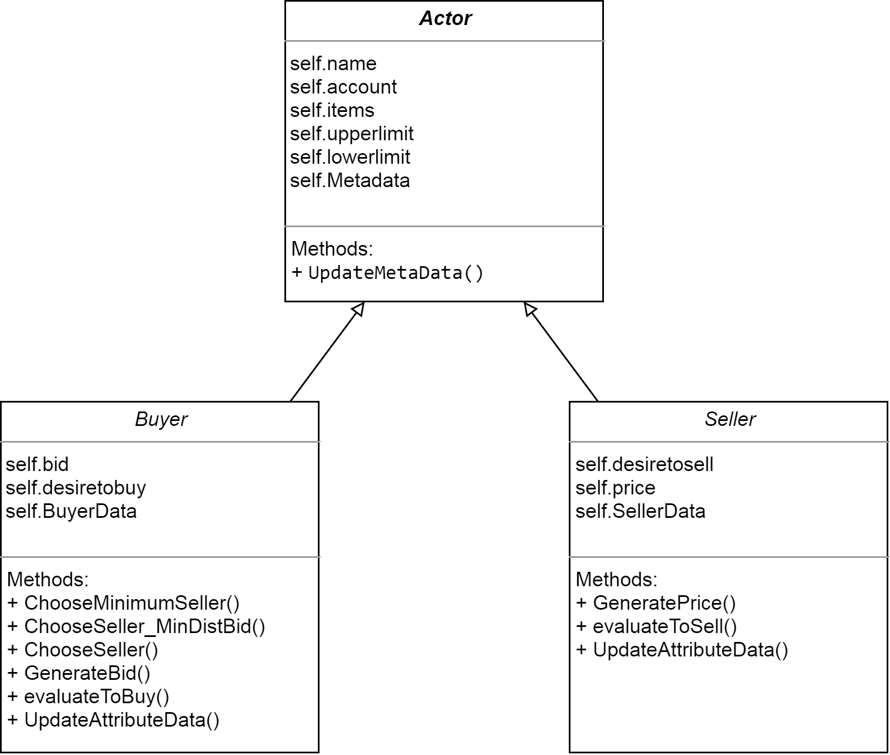

# Marketactors

The marketactors are agents, which interact with each other.
Until now, tow kinds of actors are implemented:

1. Buyers
2. Sellers

The build of those classes are shown in the graphic bellow:

Buyer and seller are inherited from the Actor class and filled with their own attributes.
The most importants attributes of actors are their `self.account`, `self.items` and 
their `self.upperlimit` and `self.lowerlimit`. Items and Account attribtes store their amount of the actor
while the limits defines, in which range the later bid or price will be choosen from.

The limits are installed, to simulate the desire, to get an item range or sell in a certain price range. 
GeneratingPrice/-Bid function will utilize the limits, as also the choosing function of the buyer.
