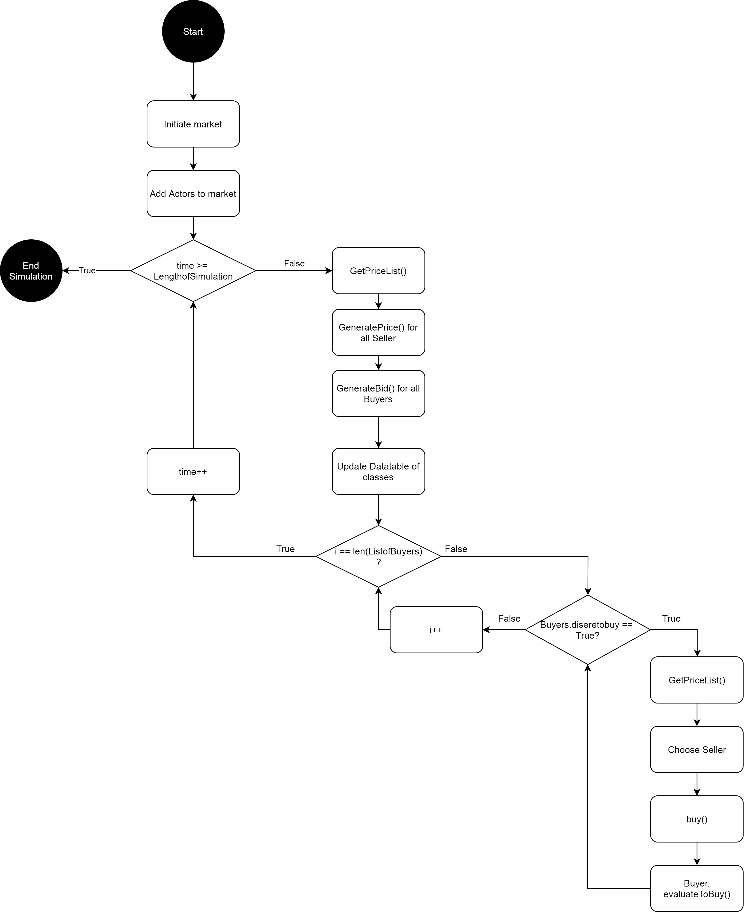

# The marketplace

The marketplace consist of three main functions:
1.buy()
2.GetPriceList()
3.SimulateIdealMarket()

Those functions ensure the functionality of the object and are ordered like in the following picture shown:

