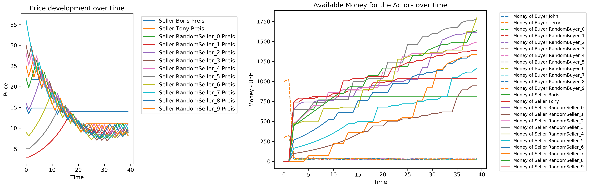

# Creating a market

The module follows a simple structure to simulate a marketplace. 
The 'Sample.py' shows how to the simulation is structured. Data is gathered
by simulating a marketplace-object, which consists of two actors: Buyers and Seller. Those are connected
to each other by the market place in a loop. The marketplace-objekt determines
how and when buyers and sellers interact with each other. 

First the market is initiated and actors are introduced:
```
from market import Marketactor, Marketplace as Market, visualization as mv

#Creation of the market
market = Market.market(ListofBuyer,ListofSeller)

#Adding randome buyers and Sellers
RandomSeller = 10
RandomBuyer = 10

for count in range(0,RandomSeller):
    market.AddRandomSeller('RandomSeller_' + str(count),50,10,30)

for count in range(0,RandomBuyer):
    market.AddRandomBuyer('RandomBuyer_' + str(count),50,10,300)
```

The marketplace-class mainly consists of two functions:
1. buy()
2. SimulateIdealMarket()

The buy() function is build to manage the transaction of an item between 
buyer and seller. In the same time, it updates a record (Buyer.UpdateMetaData()) of each actor within 
the market, to track the progress of an actor. SimulateIdealMarket() is the mainloop of the programm, 
which is described in [The Marketplace](docs\marketplace.md). After initiation the simulation is 
started by using SimulateIdealMarket(), in which you also determine the amount of rounds or steps
the simulation will take (`LengthofSimulation`), the amount of items, which are traded in one buy(`wanteditems`)
and if a buyer can executed multiple buy()'s with multiple sellers in one round/step.

```
#Run the Simulation
market.SimulateIdealMarket(LengthofSimulation = 40,     # How many Rounds to Simulate
                            wanteditems = 1,            # How many items are transfered with one buy
                            MultipleSells = True)      # How can an actor buy multiple items in one round
```

The `visualization.py` script provides functions to plot the results from the simulation.
If you want to use one of the functions you can decomment those as you see fit. 
In the `doc` folder examples of plot are stored.

For example you can display the overall accounts of all actors in the market and the progress 
of all prices by the sellers:



Or you can see the progress of every actor within the market by looking at their respective bids/prices and account/itemstorage:


